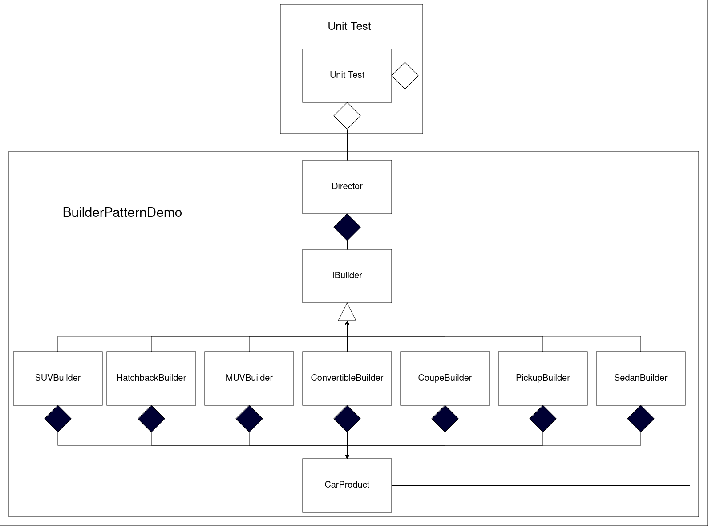

# Overview
Software Design Patterns are existing templates of code, which can be used to increase both the quality as well as the efficiency of the software. 
It is usually agreed that there are 23 Design Patterns, which are divided into three types:
<ol>
<li>Creational: used to create objects</li>
<li>Structural: organise objects and classes to form larger structures</li>
<li>Behavioral: communication between objects</li>
</ol>
 
Here, we shall be looking at one of the Creational Design Pattern, <strong>Builder</strong>. 
 
The <strong>Builder Pattern</strong> is used to construct complex objects which involve various components. The builder pattern separates the construction of a complex object from its representation. 
We begin by defining the internal structure of the object we wish to create. 
We then define an interface for building and returning the object. 
Then, based on this interface, we create concrete builders which can change the order or quantity of the components (or the internal representations of the objects) leading to a diverse collection of objects. 
Oftentimes, we also use a <strong>Director</strong> who acts as an intermediatory between the client and the builder, orchestrating the construction of the object using the appropriate builder as requested by the client. 

The Advantages of the Builder Design Pattern is that we have a greater flexibility and control over the creation of internal representation of the objects. We also encapsulate code for construction and representation. 

# Design
In this project, we are simply creating seven different car objects (Hatchback, Sedan, SUV, MUV, Convertible, Coupe, & Pickup) based on the user input.<bbr>
The user's input is taken up by the Director, who constructs and returns the requested car object.

# Environment
The project builds and runs with Visual Studio Community 2022 when the required workloads are installed.
